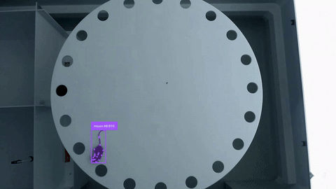
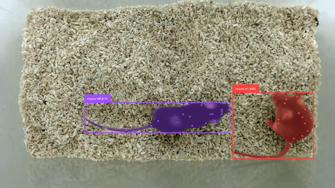
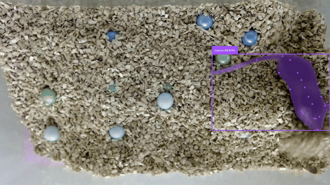
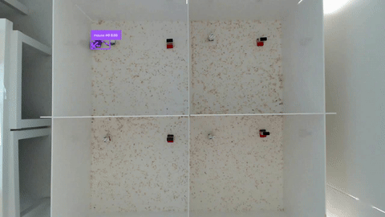
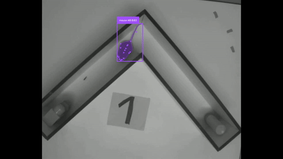
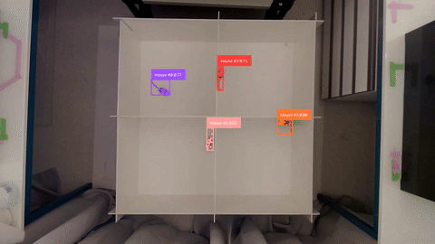
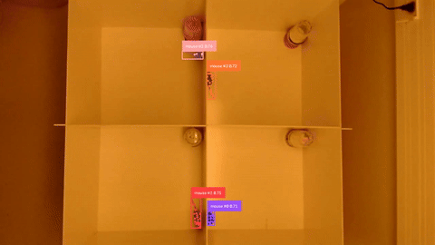
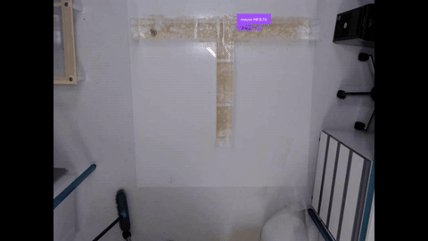
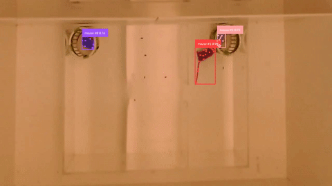

<table>
<tr>
<td align="center"><br><code>Barnes Maze</code></td>
<td align="center"><br><code>Direct Interaction</code></td>
<td align="center"><br><code>Marble burrying</code></td>
</tr>
<tr>
<td align="center"><br><code>NORT</code></td>
<td align="center"><br><code>NORT (2)</code></td>
<td align="center"><br><code>Open Field</code></td>
</tr>
<tr>
<td align="center"><br><code>Social Interaction</code></td>
<td align="center"><br><code>T-maze</code></td>
<td align="center"><br><code>Three Chamber</code></td>
</tr>
</table>

Six-second clips, annotations overlaid (boxes, masks, keypoints, track ids).

# Multi-Task Mouse Behaviour Dataset (mtmb)

Tooling for the Multi-Task Mouse Behaviour Dataset: bounding boxes, instance
masks, 27-point poses and persistent track ids for laboratory mice, on the same
frames, across nine standard behavioural assays. 14,300 frames, 27,716 annotated
instances.

This repo is the `mtmb` package -- splitting, exporting and validating the
dataset. For the full dataset card (task-by-task breakdown, annotation schema,
license, citation), see [`docs/HF_README.md`](docs/HF_README.md).

## Install

```
pip install mtmb
```

For development, clone this repo and run `uv sync`.

## Quickstart

```
mtmb tasks                                        # list tasks, what's already built
mtmb pooled                                        # image-level random split, all tasks
mtmb by-task --train barnes_maze --train marble \
             --valid nort --test t_maze            # whole tasks held out, no leakage
mtmb loo --folds 3                                  # leave-one-task-out, N folds
```

Every command builds an RF-DETR-style export under `build/<name>/{train,valid,test}`,
with a `manifest.json` recording exactly what produced it. Run `mtmb <command>
--help` for the full option list.

## Python API

```python
from mtmb.dataset import MouseDataset

dataset = MouseDataset()
manifest = dataset.split_by_task(train=["barnes_maze"], valid=["nort"], test=["t_maze"])
dataset.build(manifest)
```

## License

The `mtmb` code is MIT -- see [`LICENSE`](LICENSE). The dataset itself is
CC BY-NC 4.0, a separate license from the code -- see
[`LICENSE-DATASET`](LICENSE-DATASET) and the dataset card for why.
